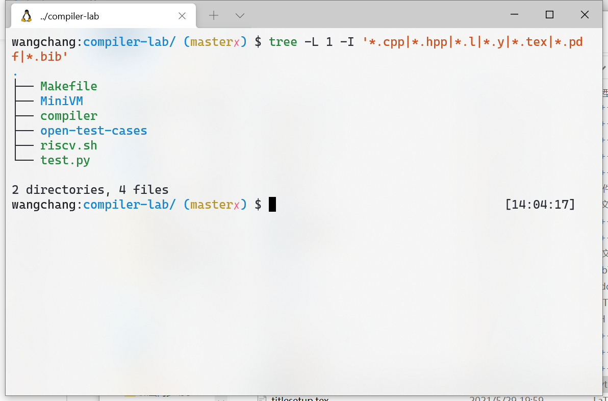
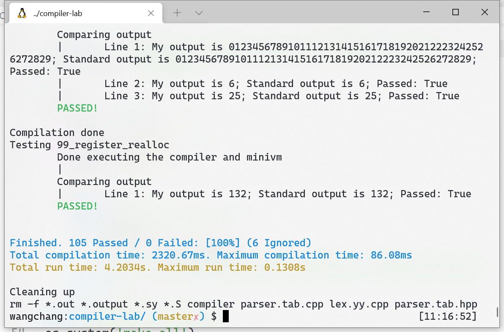

# 编译原理课程实践 测试用代码

## 使用前准备

* 执行
  ```bash
  git clone --recursive https://github.com/wangchang327/compiler-lab-test-driver.git
  ```
  (注意本仓库中的 MiniVM 是修改过的, 可以输出程序的返回值, 如果使用原版需要自己略作修改.)

* 确保可执行文件和测试代码在同一路径下, 并填写正确的测试样例和 MiniVM 的位置. 执行时, 会首先 ```make all``` 进行编译, 所以还需要 ```Makefile```. 如要不作任何更动而运行, 目录结构应当如图所示:

  

* 如要测试 RISC-V 生成, 还需要提前打开一个名为 ```riscv``` 的 docker 虚拟机:

  ```bash
  docker run -it --name riscv --rm riscv-dev-env
  ```

## 使用

````bash
python3 test.py e/t/r --verbose
````

```--verbose``` 时打印每一行的输出, 不打印更易看清每个样例的运行时间.

输出图示:


